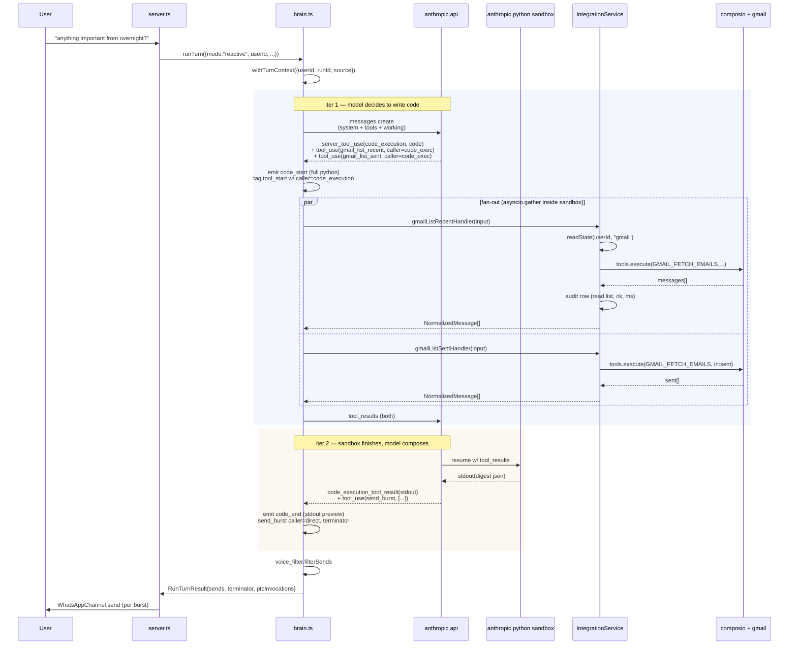
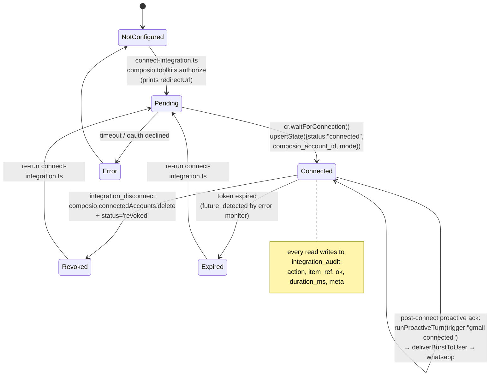
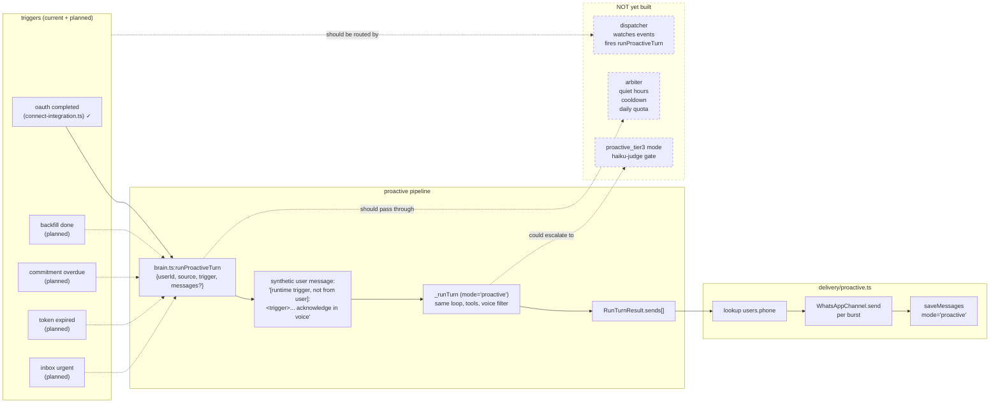
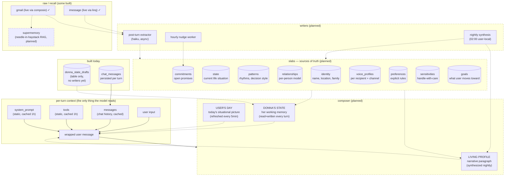

# donna · architecture

last updated: 2026-05-08

mermaid diagrams render natively on github. for local preview, use any markdown viewer with mermaid support (vs code: "markdown preview mermaid support").

---

## 1 · system overview

```mermaid
flowchart TB
    subgraph User["user surfaces"]
        WA["whatsapp client"]
        CLI["cli (npm run dev)"]
    end

    subgraph Ingress["ingress"]
        Webhook["server.ts<br/>POST /webhook"]
        WAParse["ingress/whatsapp.ts<br/>parseWebhook"]
        IMParse["ingress/imessage.ts"]
        IndexCli["index.ts<br/>readline loop"]
        Resolve["memory/users.ts<br/>getOrCreateUser(phone)"]
    end

    subgraph Brain["brain (sonnet 4.6 + ptc)"]
        RunTurn["brain.ts:runTurn<br/>mode: reactive | proactive"]
        Context["context.ts<br/>AsyncLocalStorage<br/>{userId, runId, source}"]
        Loop["sdk loop<br/>messages.create + tool dispatch"]
        Composer["wrapped user msg<br/>(future: living_profile,<br/>day, donna_state)"]
    end

    subgraph Tools["tool registry"]
        DirectTools["direct tools<br/>get_current_time<br/>send_burst<br/>integration_status<br/>integration_set_mode<br/>integration_disconnect"]
        PtcTools["ptc-callable<br/>gmail_list_recent<br/>gmail_search<br/>gmail_list_sent<br/>gmail_read_thread<br/>imessage_*"]
        CodeExec["code_execution_20250825<br/>(server tool)"]
    end

    subgraph IntegrationLayer["integration service"]
        Service["integrations/service.ts<br/>readState · upsertState<br/>executeForUser · audit<br/>setMode · disconnect"]
        StateTable[("integrations<br/>(user, provider, status,<br/>mode, exclusions,<br/>composio_account_id)")]
        AuditTable[("integration_audit<br/>(action, item_ref,<br/>caller, ok, ms, meta)")]
    end

    subgraph External["external services"]
        ComposioApi["composio platform<br/>(holds gmail oauth)"]
        GmailApi["gmail api"]
        Anthropic["anthropic api<br/>messages.create<br/>+ python sandbox"]
    end

    subgraph Egress["egress"]
        VoiceFilter["voice_filter.ts"]
        WAChannel["delivery/whatsapp.ts<br/>WhatsAppChannel.send"]
        Proactive["delivery/proactive.ts<br/>deliverBurstToUser"]
    end

    subgraph Persistence["persistence (postgres)"]
        ChatMsgs[("chat_messages<br/>history")]
        Users[("users<br/>phone → id")]
        Inbound[("inbound_messages<br/>dedup")]
        ExecRuns[("execution_runs")]
        ExecEvents[("execution_events<br/>code_start, tool_start<br/>w/ caller tag")]
        DraftsState[("donna_state_drafts<br/>(future)")]
    end

    subgraph Observability["observability"]
        LangSmith["langsmith<br/>wrapAnthropic + traceable"]
        DebugApi["GET /debug/runs<br/>GET /debug/runs/:id/events"]
    end

    WA -->|message| Webhook
    Webhook --> WAParse
    Webhook --> IMParse
    WAParse --> Resolve
    IMParse --> Resolve
    CLI --> IndexCli
    IndexCli --> Resolve

    Resolve --> RunTurn
    RunTurn --> Context
    Context --> Loop
    Composer -. assembles per turn .-> Loop

    Loop -->|tools + system + messages| Anthropic
    Anthropic -->|content blocks| Loop

    Loop --> DirectTools
    Loop --> PtcTools
    Loop -. server tool .-> CodeExec
    CodeExec -.|sandbox calls back<br/>via tool_use w/ caller| PtcTools

    PtcTools --> Service
    DirectTools --> Service
    Service --> StateTable
    Service --> AuditTable
    Service --> ComposioApi
    ComposioApi --> GmailApi

    Loop --> VoiceFilter
    VoiceFilter --> WAChannel
    WAChannel -->|burst| WA

    Loop --> ExecRuns
    Loop --> ExecEvents
    Loop --> ChatMsgs
    Loop -. trace .-> LangSmith

    Resolve --> Users
    WAParse --> Inbound
```

---

## 2 · ptc orchestration loop (one reactive turn)



---

## 3 · integration lifecycle



---

## 4 · proactive notification flow



---

## 5 · memory architecture (current + planned)



legend: solid = built today. dashed = planned (designed, not yet implemented).

---

## 6 · file map

| layer | file | role |
|---|---|---|
| ingress | `src/server.ts` | http server, webhook verify+receive, dispatch (whatsapp + imessage) |
| ingress | `src/index.ts` | cli readline loop |
| ingress | `src/donna/ingress/whatsapp.ts` | parse meta payload → IngressPayload |
| ingress | `src/donna/ingress/imessage.ts` | parse linq payload |
| identity | `src/donna/memory/users.ts` | `getOrCreateUser(phone)` |
| identity | `src/donna/memory/inbound.ts` | dedup table for inbound message ids |
| brain | `src/donna/brain.ts` | `runTurn`, `runProactiveTurn`, ptc loop, caller tagging |
| brain | `src/donna/context.ts` | `AsyncLocalStorage<TurnContext>` (userId, runId, source) |
| brain | `src/donna/prompt.ts` | SYSTEM_PROMPT (voice + orchestration + inbox_copilot_intents + integration_lifecycle) |
| brain | `src/donna/voice_filter.ts` | egress regex filter on send_burst |
| tools | `src/donna/tools/index.ts` | registry: code_execution + 4 gmail + 3 imessage + 3 integration_* + send_burst + time |
| tools | `src/donna/tools/gmail.ts` | 4 ptc-callable, all route through `executeForUser` |
| tools | `src/donna/tools/imessage.ts` | 3 ptc-callable, route through linq |
| tools | `src/donna/tools/integrations.ts` | 3 direct lifecycle tools (status, set_mode, disconnect) |
| tools | `src/donna/tools/send_burst.ts` | direct-only terminator |
| tools | `src/donna/tools/time.ts` | direct-only single-shot |
| integration | `src/donna/integrations/service.ts` | `IntegrationService`: state crud, audit, `executeForUser`, lifecycle |
| integration | `src/donna/integrations/composio.ts` | composio client wrapper (legacy entrypoint) |
| integration | `src/donna/integrations/linq.ts` | linq imessage client |
| memory | `src/donna/memory/chat.ts` | load/save `chat_messages` (modes: reactive, proactive) |
| delivery | `src/donna/delivery/whatsapp.ts` | `WhatsAppChannel.send` |
| delivery | `src/donna/delivery/proactive.ts` | `deliverBurstToUser` (whatsapp + persist + log) |
| delivery | `src/donna/delivery/messages.ts` | TextMessage / OutboundMessage types |
| observability | `src/donna/observability/execution.ts` | `execution_runs`, `execution_events`, list/finish |
| persistence | `src/donna/db.ts` | postgres client |
| config | `src/donna/config.ts` | env-loaded settings |
| scripts | `scripts/connect-integration.ts` | oauth dance + post-connect proactive ack |
| scripts | `scripts/bootstrap-integration.ts` | seed integrations row from env (legacy) |
| scripts | `scripts/inspect-context.ts` | prompt/cache audit helper |
| migrations | `supabase/migrations/20260505_chat_messages.sql` | history table |
| migrations | `supabase/migrations/20260506_inbound_messages.sql` | dedup table |
| migrations | `supabase/migrations/20260506_users.sql` | users table |
| migrations | `supabase/migrations/20260507_execution_observability.sql` | execution_runs + execution_events |
| migrations | `supabase/migrations/20260507_integrations.sql` | integrations + integration_audit + donna_state_drafts |

---

## 7 · key invariants

1. **the model only reads what's in context.** every memory layer earns its keep by reaching the prompt. storage is upstream and irrelevant to reads.
2. **handlers run inside `withTurnContext`.** every tool can read `getTurnContext().userId`. no thread-through of user identity.
3. **`executeForUser` is the only way provider apis are called.** auth, audit, mode/exclusion enforcement live there. handlers don't talk to composio directly.
4. **send_burst is direct-only.** never marked as `allowed_callers`. voice filter runs on its egress. terminator semantics enforced in brain loop.
5. **`audit` failures never break user flow.** logged + swallowed.
6. **proactive bursts go through the same brain loop, voice filter, and persistence** as reactive bursts. just a different entry point + synthetic trigger message.
7. **integration state is the source of truth for "is gmail working."** brain queries it via `integration_status`. composio's actual state is checked when the lifecycle tool fires (disconnect, future health-check).

---

## 8 · trust + privacy boundaries

```
donna's server holds:
  ANTHROPIC_API_KEY · COMPOSIO_API_KEY · WHATSAPP_TOKEN · DATABASE_URL

donna's server NEVER sees:
  user's gmail oauth tokens (composio holds)
  user's google refresh token

anthropic NEVER sees:
  composio api key
  the postgres database
  raw user data EXCEPT what flows through tool_result blocks
  (which DO appear in conversation context — careful with sensitive content)

every read is auditable:
  integration_audit(action, item_ref, ok, duration_ms, meta)
  → "what did donna touch this week"
```

---

## 9 · what's built vs not

✓ built today:
- ingress (whatsapp, imessage, cli)
- brain loop with ptc + caller-tagged events
- gmail tools via composio with audit
- imessage tools via linq
- integration lifecycle: connect cli + 3 in-conversation tools (status, set_mode, disconnect)
- proactive primitive: `runProactiveTurn` + `deliverBurstToUser`
- post-connect proactive ack (whatsapp delivery)
- observability: execution_runs/events with caller tagging, langsmith tracing

✗ not yet built:
- proactive event lane (dispatcher, arbiter, tier3 judge)
- backfill / sync workers (composio webhooks or polling)
- error → proactive (token expired, sync gap)
- memory slabs (relationships, commitments, voice, identity, state, ...)
- synthesis layer (nightly worker, living_profile, today_shape)
- composer for wrapped user message (today: just the user's message)
- supermemory recall layer
- write tools (gmail_create_draft, gmail_send, gmail_modify_labels)
- exclusion mutation tools
- forget / wipe (purge derived data on disconnect)
